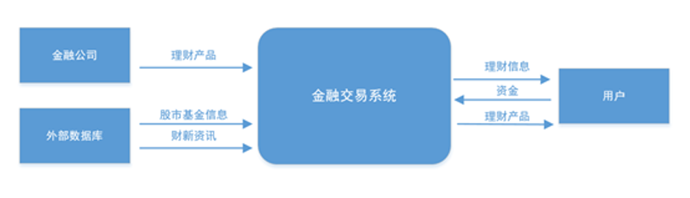

# 融易基金交易电子商城

#### 介绍
本产品是一个网上金融交易平台，主要是基金的交易。提供的自选工具方便用户挑选基金。平台提供直接交易功能，用户可以随时随地买基金,查收益,让理财变得更简单。网站每日及时提供最新基金净值数据,基金覆盖全市场,方便用户随时查询。基金公司提供最新最全基金公司规模,排名,旗下基金业绩对比和筛选，用户不必再自己到各处搜集数据。平台提供的基金数据包括基金净值,估值,排行,评级,分红,新发基金,基金经理等基金数据大全。固收理财精选固收产品,收益高,风险低,为资产保值和稳增长护航。 

#### 软件架构
软件架构说明

#### 安装教程

暂无教程

#### 使用说明
1、交易功能主要囊括了三个部分的内容：
第一，较低风险，入门门槛低的理财产品交易。理财产品适用于所有的用户，相对收益较低，操作简单，只需要执行选择理财产品和购买两个操作。
第二，风险相对较高，收益相对较高的，操作更加多样化的基金购买。对于基金产品，在选择购买的同时可以通过智能定投的方式委托系统进行每日的基金投资，是相对于理财产品更加长远化的投资，该部分功能相对更多。
第三，高风险高收益的基金买卖，基金买卖的操作需要更多的相关知识和投资目标，消费者对基金的操作要依靠自己的判断来进行。  

2、资讯传播主要是提供给投资者参考。
首先是最基本的财经资讯。结合市场的经济情况，推送基本的经济角度分析的财经类新闻。
其次是企业动态。根据消费者的投资意向，针对性的推送相企业也动态，确保用户在投资过程中有直接了解企业动态的渠道。企业动态主要包括去，企业官方给出的重大决策和企业官方回复股民或者媒体的回答。
再者是市场分析。针对当前的经济市场，会有相应的分析类文章提供给用户作参考。
最后是入门指导。本系统主要针对的用户群体是，刚入门金融领域或者想要了解的用户。入门指导是整个的基本知识的入门教程，是较为基础，主要注重于实际操作和本系统的介绍来编制的。

#### 参与贡献
充满智慧和行动力的项目经理 qay  

奋斗在编码第一线的开发人员 ls  

超级有耐心不怕熬夜的打工人 lsj  

不拘小节却追求对齐的打工人 lwy

#### 特技

1.  使用 Readme\_XXX.md 来支持不同的语言，例如 Readme\_en.md, Readme\_zh.md
2.  Gitee 官方博客 [blog.gitee.com](https://blog.gitee.com)
3.  你可以 [https://gitee.com/explore](https://gitee.com/explore) 这个地址来了解 Gitee 上的优秀开源项目
4.  [GVP](https://gitee.com/gvp) 全称是 Gitee 最有价值开源项目，是综合评定出的优秀开源项目
5.  Gitee 官方提供的使用手册 [https://gitee.com/help](https://gitee.com/help)
6.  Gitee 封面人物是一档用来展示 Gitee 会员风采的栏目 [https://gitee.com/gitee-stars/](https://gitee.com/gitee-stars/)
